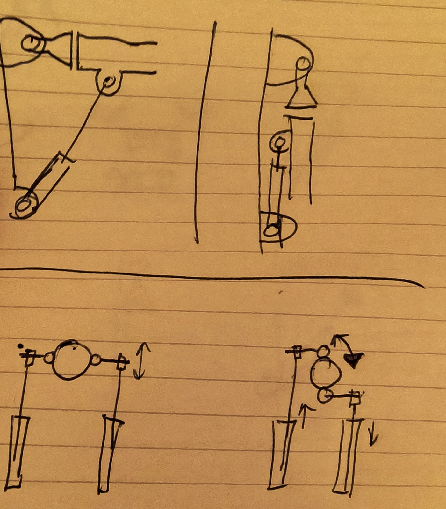

# 2-DOF-gewricht met twee cilinders

## Het principe

Een kruiskoppeling (cardan) in het midden draagt de arm. Aan weerszijden van het
midden zit een hefboom, en aan het eind van elke hefboom een cilinder.

- **Beide cilinders dezelfde kant op:** de arm kantelt op en neer (pitch).
- **Eén cilinder uit, de andere in:** de arm draait om de as die van de kijker af
  loopt in de onderste schetsen (roll).

Hetzelfde principe zit in de enkels en polsen van veel humanoïde robots: twee lineaire
actuatoren naast elkaar op een kruiskoppeling.

## Eigenschappen

- **Voor op en neer werken de cilinders samen:** samen leveren ze het koppel tegen de
  zwaartekracht. De zware as krijgt dus de kracht van twee cilinders.
- **Koppel:** pitch = (F1 + F2) · r, roll = (F1 − F2) · b. Daarbij is r de afstand
  van de pitch-as tot de aangrijppunten, en b de halve afstand tussen de twee
  aangrijppunten.
- **Draaien onder last:** de cilinders delen het werk. Bij maximale last voor op en
  neer blijft er minder over om te draaien.
- **Bewegingen zijn gekoppeld en niet-lineair:** de gewenste hoeken worden in software
  omgerekend naar twee cilinderlengtes (inverse kinematica).

## Wat in het ontwerp opgelost moet worden

1. **Middelste gewricht:** een kruiskoppeling, met de twee assen elkaar snijdend. Die
   draagt al het gewicht en alle zijkrachten van de arm en moet dus stevig zijn.
2. **Cilinderuiteinden:** de aangrijppunten bewegen in drie dimensies. Beide uiteinden
   van elke cilinder hebben dus een kogelgewricht of kruiskoppeling nodig. Gewone
   kogelkoppen (rod end bearings) halen maar ongeveer ±13–15° scheefstand. Bij grote
   hoeken lopen ze vast; dan zijn kogelkoppen voor grote hoeken of kleine
   kruiskoppelingen nodig.
3. **Hefboomwerking aan de randen:** het koppel is het grootst als cilinder en hefboom
   haaks op elkaar staan, en neemt af naarmate ze in één lijn komen. Het
   bewegingsbereik wordt zo gekozen dat ze binnen ongeveer ±30–40° van haaks blijven.
4. **Geen zijkracht op de stangen:** de kruiskoppeling vangt de zijkrachten op, niet
   de cilinders.

## Vasthouden bij een slangbreuk

De cilinders moeten hun positie vasthouden. Dichte ventielen doen dat zolang de slangen
heel blijven. Breekt of schiet een slang los tussen ventiel en cilinder, dan loopt die
kamer leeg en zakt de arm met zijn last. Daarom komen er bij de arm ontgrendelbare
terugslagkleppen direct op de cilinderpoorten. Die laten lucht alleen uit de kamer als
er stuurdruk op staat; zonder stuurdruk zit de lucht opgesloten in de cilinder. Voor de
proef is dit niet nodig.

## Krachtberekening schouder (eerste ruwe berekening)

Uitgangspunten van de klant: 15 kg op 1 m van het scharnier, cilinders 50 cm lang en
maximaal 37 cm van het scharnier aangegrepen, 5 bar, twee cilinders die samen duwen
met het volle zuigeroppervlak.

| Geval | Koppel | Kracht totaal (hefboom 0,37 m) | Ø per cilinder, minimaal |
|---|---|---|---|
| Gewichtloze arm, 15 kg op 1 m | 147 Nm | 398 N | 2,3–2,4 cm |
| Plus arm van 30 kg met zwaartepunt op 0,5 m | 294 Nm | 795 N | 3,2–3,4 cm |

Dit is de statische ondergrens: cilinder haaks op de hefboom, geen versnelling, geen
wrijving. Voor een werkende regeling komt daar marge bij:

- **Hefboom onder een hoek:** de werkzame hefboom is 0,37 m · sin(hoek tussen
  cilinder en hefboom). Bij 45° scheef is de benodigde kracht 1,4× zo groot.
- **Regelruimte:** om te kunnen versnellen en afremmen mag de statische last maar een
  deel van de beschikbare kracht gebruiken. Ook de tegendruk in de andere kamer en de
  drukval over de ventielen bij bewegen gaan van de kracht af. Hoeveel marge nodig
  is, meet proef T7.
- **Draaien onder last:** bij roll draagt één cilinder meer dan de helft.
- **Standaardmaten:** Ø25, 32, 40, 50. Met Ø40 gebruikt de statische last 63% van de
  beschikbare kracht (2× 628 N bij 5 bar), met Ø50 40% (2× 982 N).

**Kracht tegenover bereik.** Een grote hefboom geeft veel kracht, maar weinig hoek per
centimeter slag. De hoek is ruwweg slag / hefboom (in radialen): 20 cm slag op 37 cm
hefboom geeft ongeveer 30°. Meer hoek vraagt een kortere hefboom en dus een dikkere
cilinder.

## Open vragen

- Waar komt dit gewricht in de arm: schouder, elleboog of pols?
- Is "draaien" bedoeld als draaien om de eigen as van de arm (zoals een pols die een
  sleutel omdraait), of als zijwaarts zwaaien (links-rechts)? De schets geeft het
  eerste. Voor zijwaarts zwaaien moet de tweede as van de kruiskoppeling anders staan.
- Gewenst bereik in graden voor op en neer en voor draaien. Dit bepaalt samen met de
  slag de hefboomlengte.
- Slag van de 50 cm-cilinders.
- Afmetingen: lengte van de hefbomen, en waar de cilinders aan de onderkant vastzitten.

## Status

Schets ontvangen op 2026-10-04. Het gewricht wordt gebruikt voor de schouder en de
elleboog, met verschillende cilindermaten. Eerste krachtberekening voor de schouder
hierboven. Uitwerking en simulatie wachten tot de proefopstelling bewijst dat
pneumatiek werkt.
