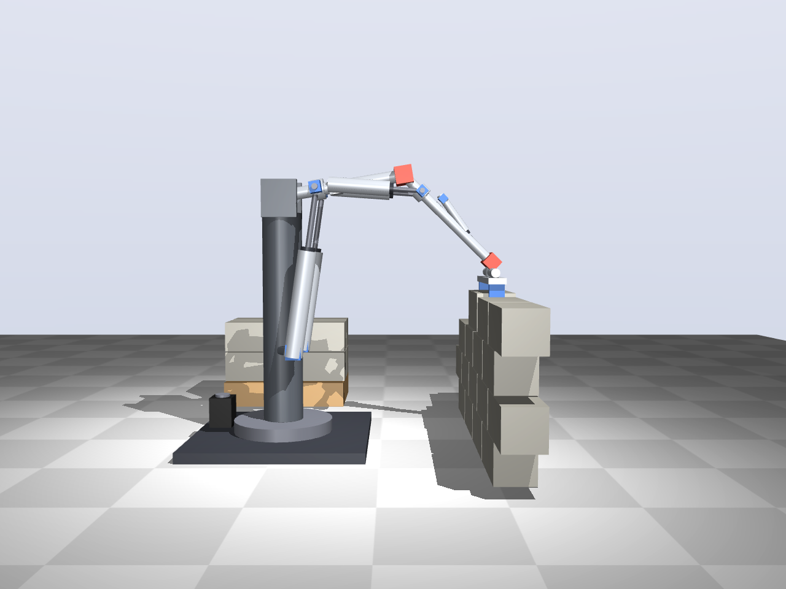
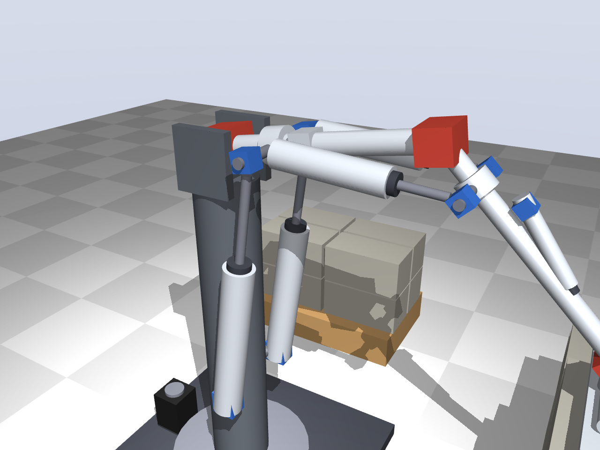

# Full arm — concept

A first picture of the complete arm, placing a 15 kg block on a wall. Simple shapes only,
to show the layout and proportions; the sizes come from
[docs/full-arm-sizing.md](../docs/full-arm-sizing.md). Not a worked-out design.

## Layout

| Joint | DOF | Drive | Why |
|---|---|---|---|
| Base yaw | 1 | Electric: stepper with belt on a slewing ring | A vertical axis carries no gravity torque, so a small motor is enough, and it can turn further than the ≈ 120° of a cylinder |
| Shoulder | 2 (pitch + roll) | 2 × Ø63 × 300, lever 150 mm; the [test 2](../test2/README.md) joint at ≈ 1.7× scale | 162 Nm with 15 kg at 1 m |
| Elbow | 2 (pitch + roll) | 2 × Ø50 lying along the upper arm, like a biceps | ≈ 80 Nm with 15 kg at 0.5 m |
| Wrist | 1 (pitch) | 1 small cylinder along the forearm | keeps the block level |
| Gripper | — | two jaws closed by a pneumatic cylinder | clamps the block at its ends |

- Upper arm and forearm 0.5 m each, shoulder 1.0 m above the floor.
- Cylinders for the heavy joints, a small motor where there is no gravity torque.
- In the render the shoulder is at pitch +9.5° and the forearm at −44.5°; the wrist is
  1.0 m from the shoulder at a reach of 0.85 m.

## Open

- Elbow lever: in this pose the elbow cylinders have a lever of only about 55 mm. Work it
  out like the shoulder (range, stroke, clashes).
- Wrist: pitch only, or also rotation (for turning blocks and for the toilet task).
- Gripper for blocks versus a tool mount for light tasks.
- Base: fixed, on a pallet with counterweight, or on wheels.

`python full-arm/concept.py` renders the three views into `out/`.
