# Full arm — concept

A first picture of the complete arm, placing a 15 kg block on a low wall. Simple shapes
only, to show the layout and proportions; the sizes come from
[docs/full-arm-sizing.md](../docs/full-arm-sizing.md). The renders keep both rolls at 0 and
line the block up with the gripper's yaw motor (see "Choice for now"). Not a worked-out
design.

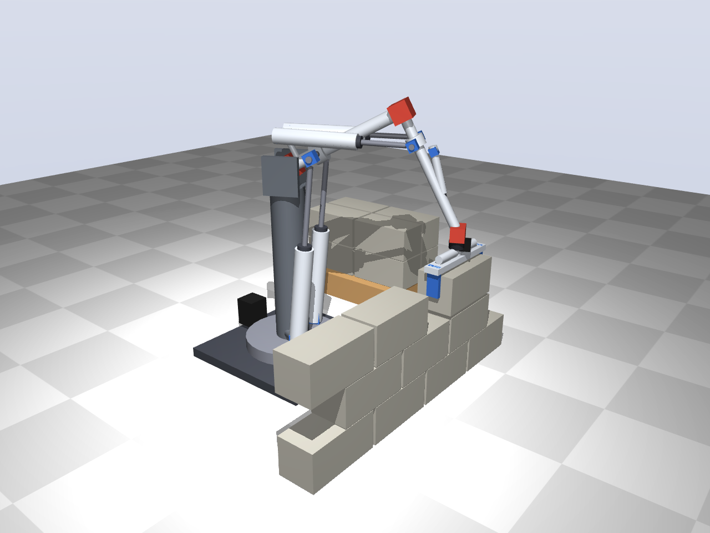

## Layout

| Joint | DOF | Drive | Why |
|---|---|---|---|
| Base yaw | 1 | Electric: stepper with belt on a slewing ring | A vertical axis carries no gravity torque, so a small motor is enough, and it can turn further than the ≈ 120° of a cylinder |
| Shoulder | 2 (pitch + roll) | 2 × Ø50 × 300, lever 150 mm (Ø63 in the renders); the [test 2](../test2/README.md) joint at ≈ 1.7× scale | 162 Nm with 15 kg at 1 m (peak), 97 Nm at 0.6 m (work) |
| Elbow | 2 (pitch + forearm roll) | 2 × Ø40–50 lying on top of the upper arm, like a biceps; the same joint as the shoulder | see below |
| Wrist | 1 (pitch) | 1 small cylinder along the forearm | keeps the block level |
| Gripper | — | two jaws closed by a pneumatic cylinder | clamps the block at its ends |

- Upper arm and forearm 0.5 m each, shoulder 0.8 m above the floor, wall 0.6 m in front of
  the base: a low wall of 3 courses, about 1 m wide.
- Cylinders for the heavy joints, a small motor where there is no gravity torque.

## Elbow: forearm roll instead of a wrist rotation (`python full-arm/elbow.py`)

The elbow uses the same 2-DOF joint as the shoulder. Its roll turns the forearm about its
own axis, as in a human forearm, so the gripper needs no separate rotation. With base
yaw, shoulder pitch + roll, elbow pitch + roll and wrist pitch the arm has 6 DOF: enough
to hold the block level and lined up with the wall.

Required for 9 block positions (3 along the wall, 3 courses), 15 kg block + 3 kg gripper:

| | Range |
|---|---|
| Base yaw | ±41° |
| Shoulder pitch / roll | −7° … +30° / ±20° |
| Elbow pitch | −101° … −64° (forearm steep) |
| Forearm roll | ±42° |
| Wrist pitch | 59° … 78° |
| Elbow cylinders, pin to pin | 454–582 mm (128 mm of stroke used) |
| Elbow cylinder force | ≤ 187 N push: 19% of Ø50, 30% of Ø40 at 5 bar |

- **Feasible.** The shoulder roll stays well within its ±65°; the forearm roll of ±42° just
  fits the ≈ ±45° the elbow allows (see the clash check below).
- The rolls grow with the base yaw: for a wall 1.2 m wide (base yaw ±42° at the ends of a
  wall 0.5 m away) the shoulder needs up to ±86° and the forearm ±69°, beyond the
  joint. For wider walls the base moves along the wall, or the gripper gets its own
  rotation about the vertical (a small motor; no gravity torque there).
- The cylinders lie on top of the upper arm (rear pivots 6 cm from the shoulder, 12 cm
  above the arm axis and 6 cm to the sides, clear of the shoulder hub and its cross
  blocks), on a forearm hub 12 cm from the elbow. A Ø50 × 200 (pin to pin ≈ 390–590 mm)
  covers the lengths.
- Ø40 is enough for the low wall (forearm steep). With the forearm horizontal the elbow
  needs up to ≈ 80 Nm, then Ø50.

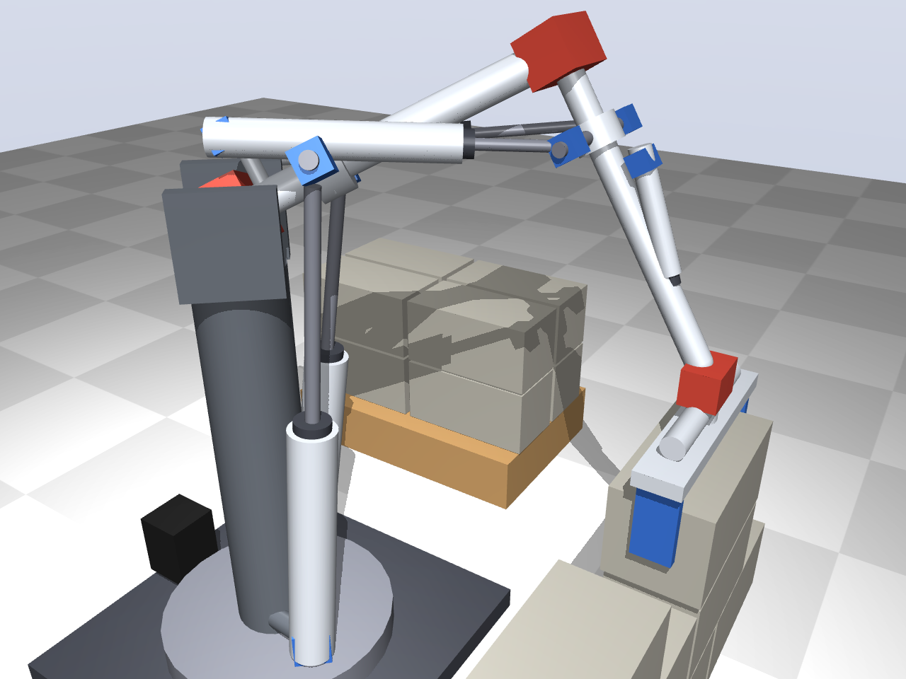

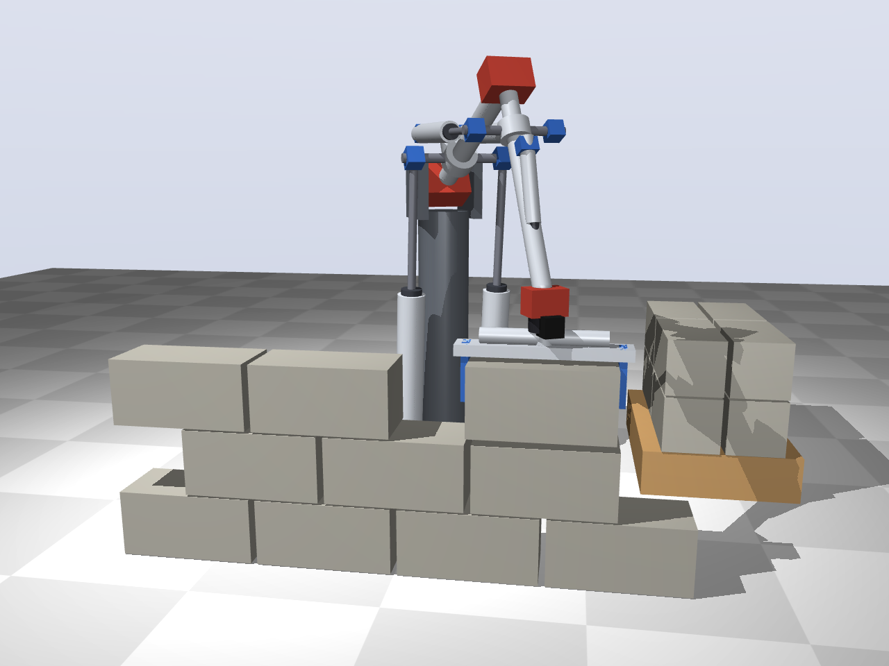

### Clash check (`python full-arm/elbow_cad.py`)

CadQuery model of the elbow region in the upper-arm frame: upper arm with the shoulder hub
and its cross blocks, the post with the rear U-joints, the elbow fork and yoke, the forearm
hub with cross blocks, and the two cylinders with rod forks.

| Elbow pitch | Roll 0° | Roll ±42–45° | Roll ±65° |
|---|---|---|---|
| −110° | ok | rod fork touches the forearm hub | many clashes, too short |
| −100° | ok | ok at ±42°, rod fork touches the hub at ±45° | cylinder bodies on the upper arm and shoulder hub |
| −90° … −64° | ok | ok | cylinder bodies on the upper arm and shoulder hub |
| −50° | ok | stroke too short | stroke too short, clashes |

- **The low wall works:** its whole range (pitch −101° … −64°, roll ±42°) is clash-free and
  within the stroke.
- **But the margin is small.** The forearm roll of this layout ends at about ±45°, not the
  ±65° of the shoulder: when rolling, one cylinder dives onto the upper arm and the rod fork
  comes close to the forearm hub.

### Biceps or triceps

The same checks for the cylinders behind the elbow: the forearm shaft sticks out 10 cm
behind the elbow through the joint, with cross blocks 8 cm to the sides; the cylinders lie
high on top of the upper arm and pull that lever, like a triceps or the stick cylinder of
an excavator (`python full-arm/elbow.py triceps`, `python full-arm/elbow_cad.py triceps`).

| | Biceps | Triceps |
|---|---|---|
| Hub on the forearm | 12 cm in front of the elbow | 10 cm behind the elbow |
| Rear pivots | 6 cm from the shoulder, 12 cm up, 6 cm to the sides | 2 cm from the shoulder (post leaning back over the shoulder yoke), 13 cm up, 8 cm to the sides |
| Cylinders | Ø50 × 200 | Ø40 × 200 (shorter: the hub is closer to the rear pivots) |
| Low wall: force | ≤ 187 N push (19% of Ø50) | ≤ 197 N pull (37% of Ø40, 24% of Ø50) |
| Clash-free with roll ±45° | elbow bend 60°–90° (±42° up to 101°) | elbow bend 45°–105° |
| Roll ±65° | cylinder bodies dive onto the upper arm and shoulder hub | only the rod forks touch the small hub at the end of the lever |
| Arm almost straight (bend 30°) | ok | the lever behind the elbow hits the upper arm |

- **Triceps gives the forearm roll more room.** The cylinders never cross the elbow, so they
  cannot dive onto the upper arm when rolling; what is left at ±65° is the hub at the end
  of the lever, which is a detail.
- **Costs of the triceps:** the cylinders pull (smaller annulus area, so Ø50 rather than
  Ø40 once the forearm has to be held horizontal), the forearm shaft has to pass through
  the elbow joint, and the arm cannot be stretched straight.

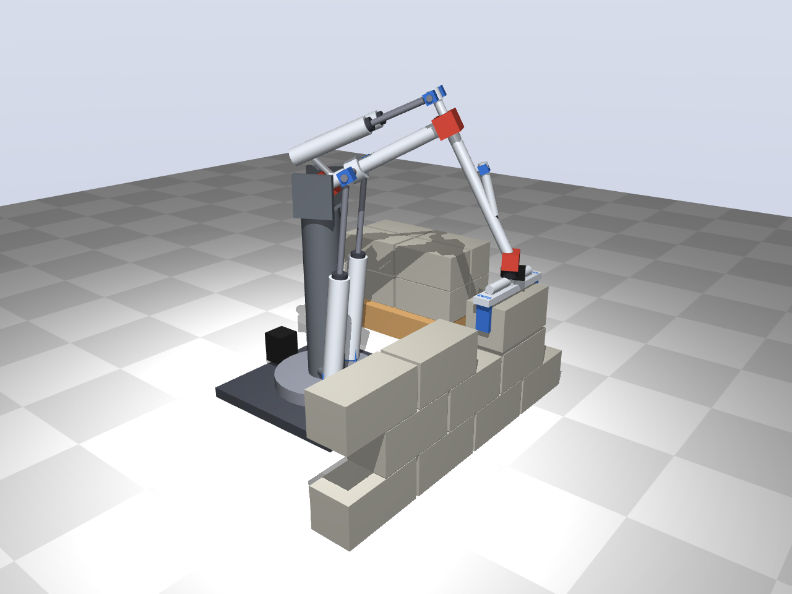

### Arm turned over: elbow below the shoulder (`python full-arm/elbow.py triceps_down`)

Like a human arm: the upper arm hangs down from the shoulder, the forearm points forward,
and the cylinders behind the upper arm push the lever behind the elbow to lift. Shoulder
at 0.8 m, same low wall.

| | Elbow up, biceps | Elbow down, triceps pushing |
|---|---|---|
| Elbow cylinders | push, ≤ 187 N (19% of Ø50) | push, ≤ 400 N (41% of Ø50): the forearm reaches forward, so the elbow carries more |
| Shoulder pitch | −7° … +30° (the test 2 shoulder layout) | −78° … −49°: the shoulder cylinders need a different layout |
| Shoulder torque | up to 162 Nm (arm stretched forward) | ≤ 128 Nm (upper arm hangs) |
| Block lined up with the wall | 9/9 positions with rolls ≤ ±60° | 3/9: only straight ahead; at ±0.3 m the shoulder roll needs up to ±84° |

- With the forearm roughly horizontal, the forearm roll tilts the block instead of turning
  it. Lining the block up then has to come from the shoulder roll (as the human shoulder
  does), and that needs more than the ±65° of the cross block joint.
- Elbow down therefore needs a gripper that turns about the vertical (a small motor, no
  gravity torque there), or a base that moves along the wall. The forearm roll then tilts
  the tool, which is useful for wiping.

## Holding a glass

A lighter job for the same arm: holding a glass of water just above a table (rolls at 0,
the gripper's yaw motor keeps the jaws square to the arm). Shoulder pitch 64°, elbow −90°.

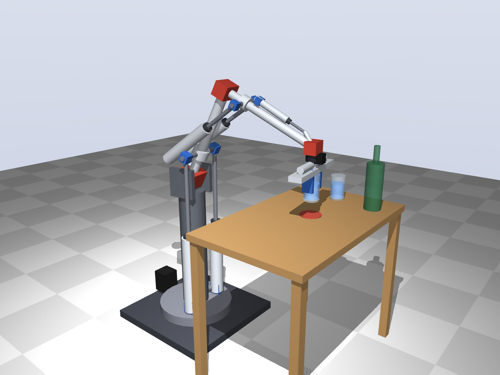

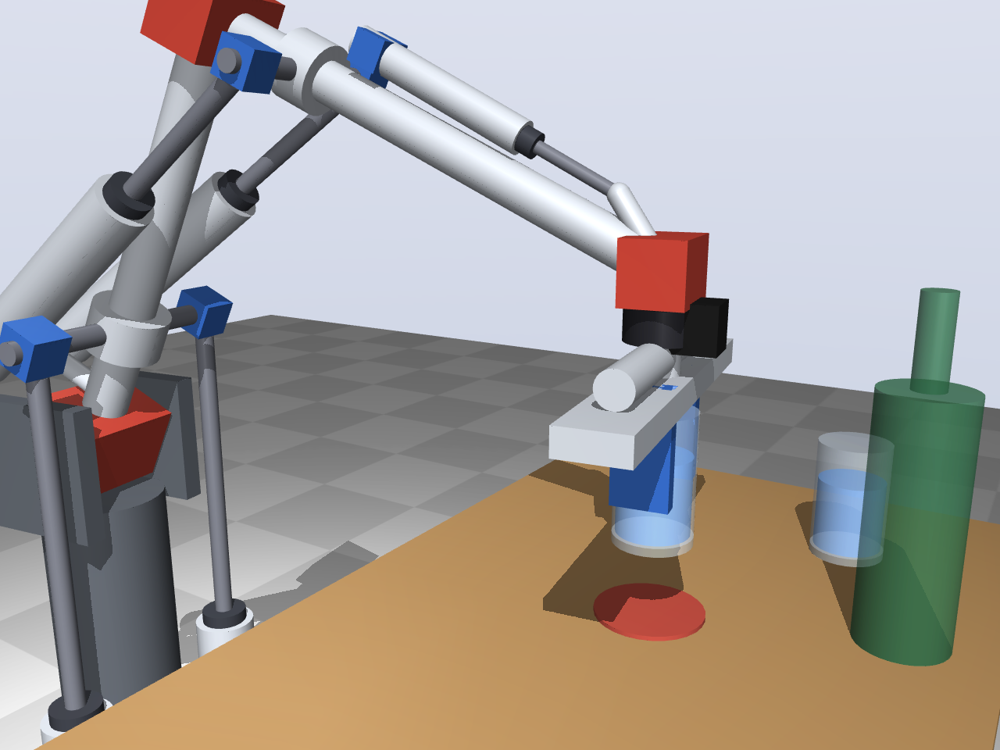

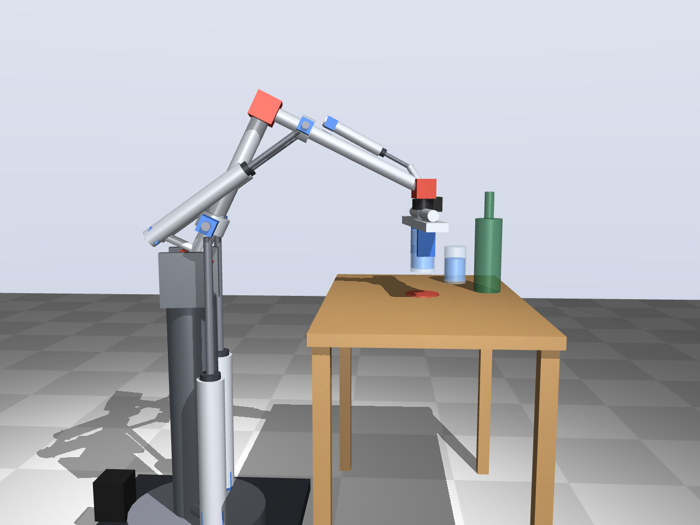

The same with the upper arm hanging down (shoulder at 1.15 m, elbow cylinders behind the
upper arm, 60 mm from it and 20 cm from the shoulder: compact Ø50 × 100 cylinders, 22–30 cm pin
to pin, pushing a 9 cm lever behind the elbow; elbow range 10–90°). Render only; the shoulder cylinders are
still drawn in the test 2 layout, which does not suit this posture.

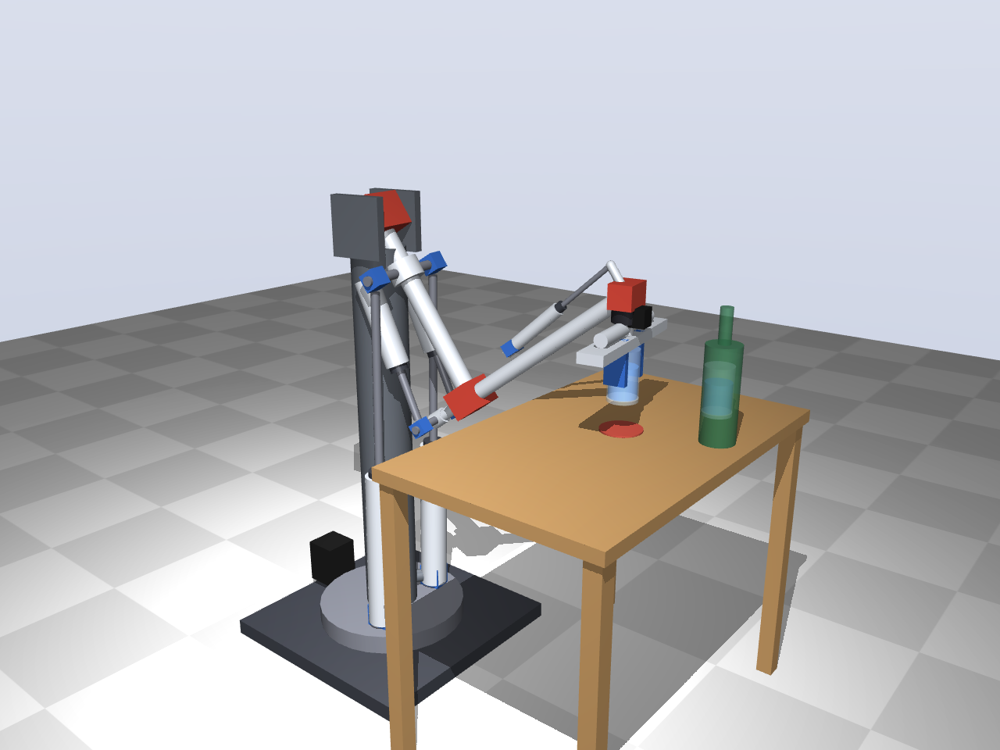

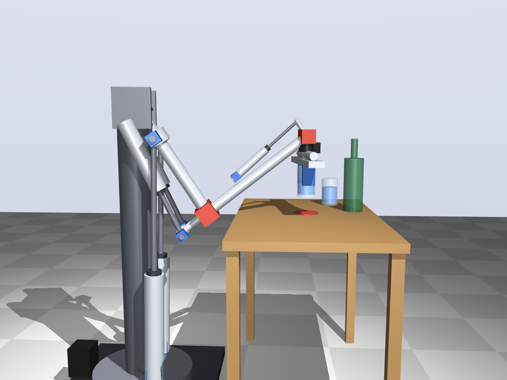

## Cocktail impression (`python full-arm/cocktail.py`)

A light version of the arm (upper arm hanging, shoulder at 1.28 m; Ø25 × 80 elbow cylinders
beside the upper arm on a 5 cm lever, elbow 10–120°; wrist and gripper turned by small
motors) makes a cocktail: three bottles poured into a glass, stirred with a bar spoon, glass
slid forward. Kinematic only, 49 s; the video is not kept in git (`--stills` for frames).

The shoulder cylinders lean back from a bracket behind the column on purpose: they push a
hub 15 cm along the upper arm, and the lever they act on is that line, not the vertical.
Over the video (upper arm −91° … −52°) their lever is 121–150 mm, largest where the arm
reaches furthest forward and gravity pulls hardest; peak force about 124 N. Cylinders
standing vertically under the shoulder would be nearly in line with the hanging upper arm:
lever 31–137 mm, peak force about 330 N.

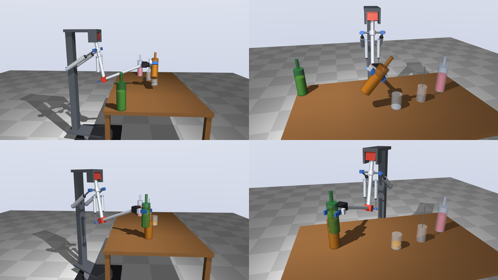

## Small wall: start of stage 1 (`python full-arm/small_wall.py`)

The intermediate goal of [docs/small-wall.md](../docs/small-wall.md): the light arm
(shoulder 0.66 m above the table, 2 × Ø32 on a 100 mm lever) with four wooden blocks in a
corner jig and the taped places of the row against a stop strip. The gripper points down
(wrist motor) and is the proposed parallel gripper. `--check` lists the joint angles of
every pick and place: elbow bend 83–101°, base yaw −70° … +18°, shoulder cylinders
248–267 mm pin to pin with a lever of 94–99 mm.

`--video` renders stage 1a (speeds of the heavy arm: 58 s, about 14 s per block) and
`--video --fast` stage 1b (light arm's own speed: 25 s, about 6 s per block). Kinematic
only; the videos are not kept in git.

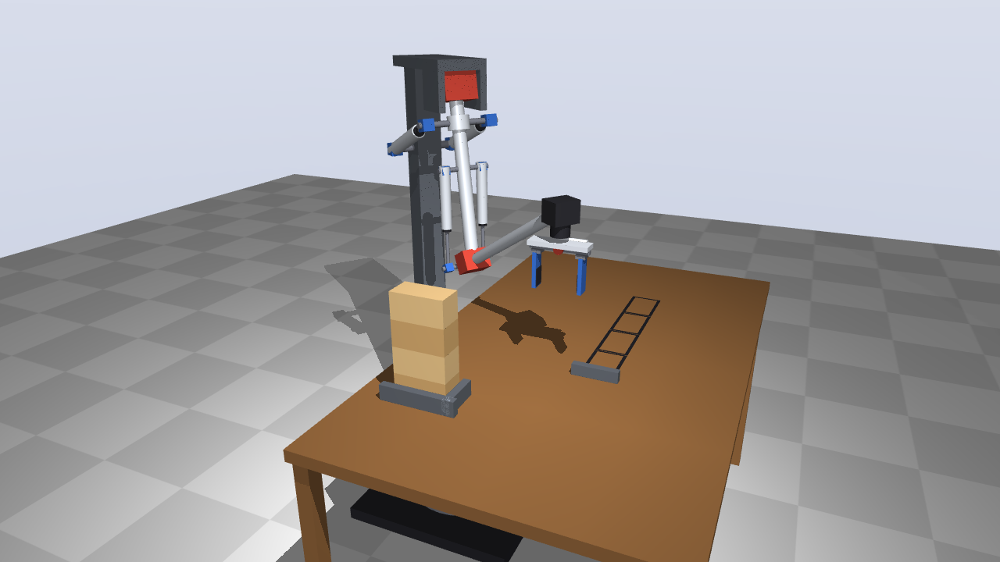

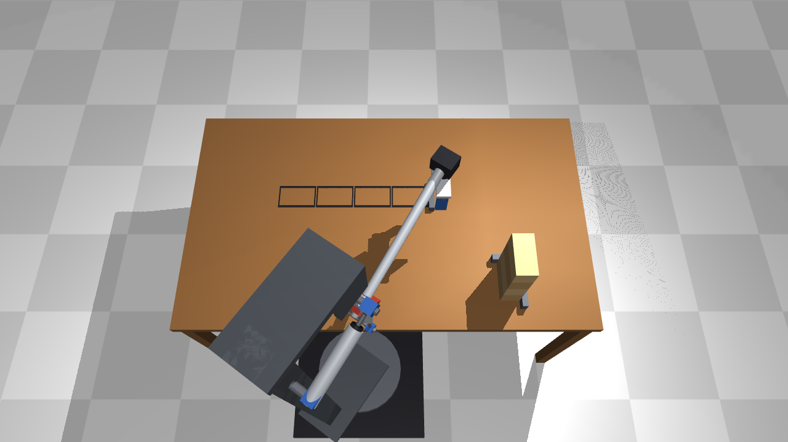

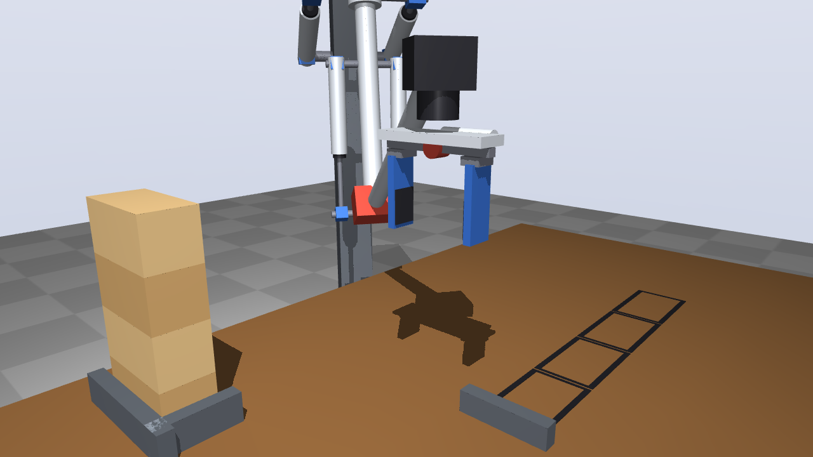

### Dynamic simulation (`python full-arm/arm_sim.py`)

The same stage 1 with a physical arm: MuJoCo for the links and the block, the test 1
pneumatics model (ISO 6358 flow, chamber pressures, VQ110U valves with switching times)
for the shoulder and elbow cylinders, and the test 1 controller for each of those joints
with its own gains. Base yaw and wrist are stiff motor servos. Before gripping or releasing,
the program waits until the gripper is within ±3 mm of its target and nearly still.
Results in [out/sim/results.md](out/sim/results.md):

| Case | Stage 1 time | Waiting | Lag while moving | Placement error |
|---|---|---|---|---|
| 0.3 kg, fast | 23.4 s | 3.2 s | 31 mm | ≤ 4 mm |
| 1.5 kg, fast | 23.7 s | 3.6 s | 40 mm | ≤ 3 mm |
| 3 kg, elbow 2 × Ø25, fast | 31.6 s | 11.5 s | 184 mm | up to 48 mm |
| 3 kg, elbow 2 × Ø32, retuned, fast | 29.0 s | 8.9 s | 214 mm | up to 18 mm |
| 1.5 kg, controlled | 53.5 s | 3.4 s | 13 mm | ≤ 3 mm |
| 3 kg, elbow 2 × Ø32, retuned, controlled | 56.3 s | 6.1 s | 16 mm | ≤ 3 mm |

- **Up to 1.5 kg the load hardly matters:** about 23.5 s fast (plan 20.1 s), placement
  within 4 mm.
- **3 kg at the fast speeds is beyond the arm.** The air springs of shoulder and elbow
  carry the arm at only 1.0–1.6 Hz (effective mass at the rod 100–460 kg); with 3 kg the
  arm lags up to 0.2 m behind the plan, swings at the end of a move, waits up to the 3 s
  limit and sometimes places a block 2–5 cm off. A larger elbow cylinder (Ø32) and
  retuned gains help only a little.
- **3 kg at the controlled speeds works:** 56 s instead of 54 s, placement within 3 mm.
- So for heavier blocks the arm either moves slower, or it needs the compensation of
  stage 1b: feedforward of gravity and acceleration, so that the cylinders already push
  when the move starts instead of after an error has built up.
- The numbers are as good as the model: the pneumatics model and the friction estimates
  are checked against the real cylinder in test 1 (T1–T3). No contacts are simulated (a
  block that is placed too low would in reality hit the table).

`--tune` runs step tests; `--video N` renders case N of `CASES` with the planned gripper as
a green ghost (MP4 not kept in git).

## Choice for now

- **Elbow above the shoulder, biceps layout (cylinders pushing).** The test 2 shoulder
  carries over as it is, the forearm hangs steeply so the elbow forces stay low (Ø40–50),
  and the elbow stays high, out of the way of the wall. Excavators are built this way for
  the same reasons.
- **Gripper turns about the vertical with a small motor.** Lining a block up with the wall
  is then one simple, stiff axis with no gravity torque, instead of two soft pneumatic roll
  joints that both have to move. The shoulder and forearm rolls stay for dexterity
  (tilting a tool, the toilet task), not for lining up blocks.
- **Wrist kept level:** a small cylinder for now; a parallelogram linkage that keeps the
  gripper level by itself (as on palletising robots) is an option to look at.
- **Triceps and elbow-down stay documented as alternatives** (above).
- **The light version (1.5 kg) is built first,** with light wall blocks and speeds capped to
  those of the heavy version; see [docs/plan.md](../docs/plan.md#first-complete-arm-the-light-version).
- **The full arm stays a concept until test 1 has its results.** Test T7 sets how much of
  the cylinder force the control can use; that number sets every cylinder size here.

## Open

- Reach: with 2 × 0.5 m the arm builds a low wall from one spot; more needs a longer arm
  or a base that moves.
- Gripper for blocks versus a tool mount for light tasks.
- Base: fixed, on a pallet with counterweight, or on wheels.

`python full-arm/concept.py [triceps] [glass]` renders the views into `out/` (the first version is in
`out/archive/`).
