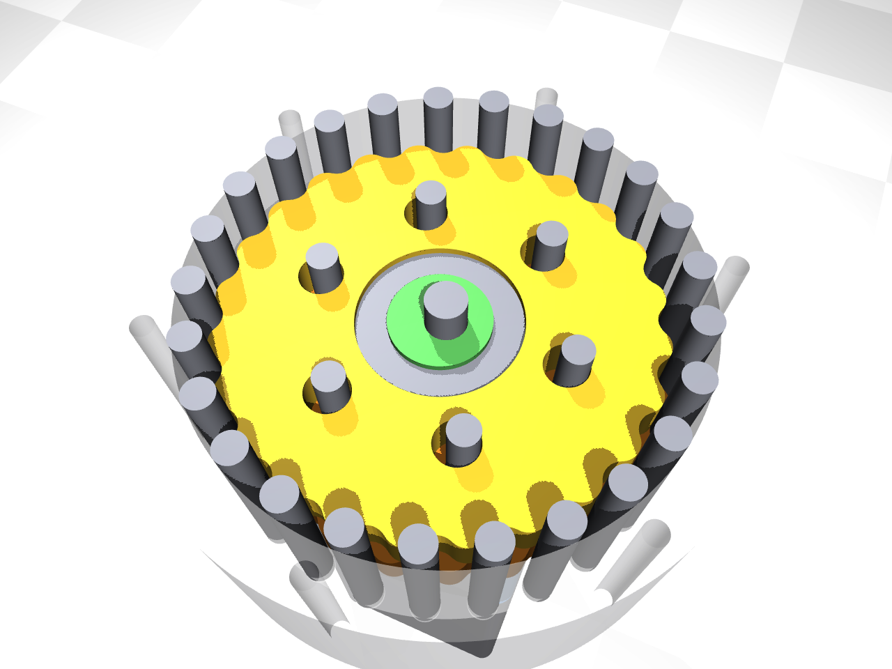
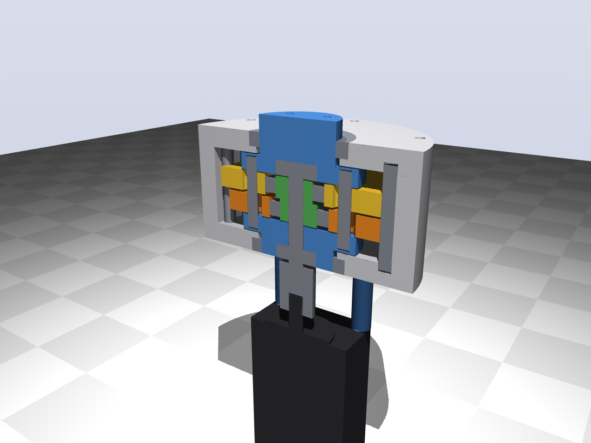
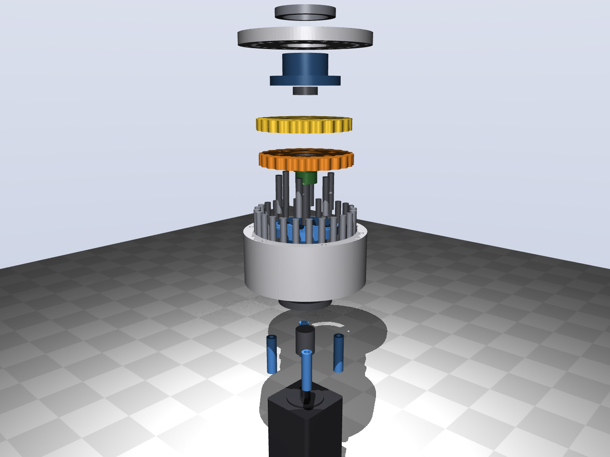
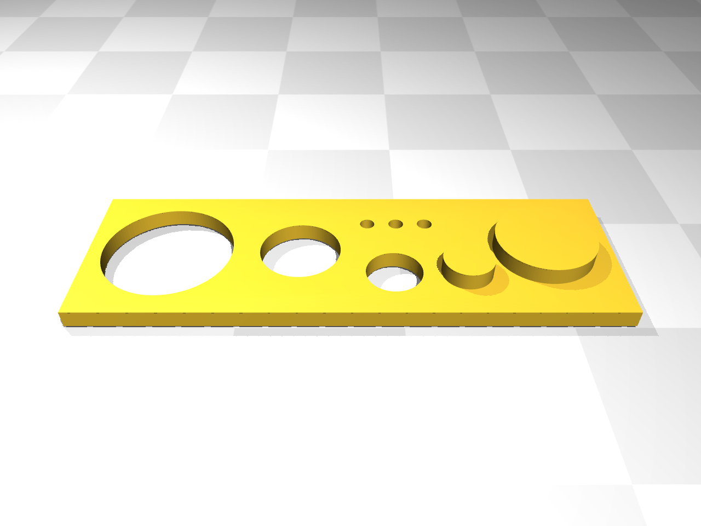

# Test 1 reference — printed cycloidal drive (on hold)

**On hold.** The arm is driven by cylinders on levers: a plain hinge carries the arm and
the cylinder only pushes. A gearbox in the joint has to transmit the torque and carry the
arm at the same time, which needs precise bearings and fits. The printed cycloid answers
no question the arm needs, so it is kept here, ready to print, but is not on the path to
the arm.

A second electric reference for [test 1](../test1/README.md), next to the
[harmonic drive](../test1-harmonic-drive/README.md): the same arm, load, motor and angle
sensor, but with a cycloidal drive printed in PLA. Only the gearbox differs, so the
comparison shows what printing costs in backlash, stiffness and strength.

## How it works

- The motor turns a double eccentric (cam) on the input shaft, 1.2 mm off centre.
- Each disc rolls around inside a ring of 25 steel pins. The disc has 24 lobes, so per
  input turn it moves back by one lobe: **24:1**, output turning the other way.
- Two discs run half a turn apart, so their forces balance and the drive runs smoothly.
- Six steel pins through oversized holes in the discs (hole = pin + 2 × eccentricity) take
  the slow rotation off the discs and turn the two carriers, which are the output.
- Both carriers run in a 6808 bearing in the housing; the input shaft runs in a 608
  bearing in each carrier, so the motor shaft carries no load (flexible coupling).

## Sizing (`python cyparams.py`)

| | 1.5 kg | 3 kg (T5) |
|---|---|---|
| Torque at the joint (horizontal, 180°/s²) | 7.3 Nm | 13.9 Nm |
| Torque at the motor (efficiency 75%) | 0.40 Nm | 0.77 Nm |
| Largest pin force | 19 N | 37 N |
| Contact stress steel pin on PLA lobe | ≈ 28 MPa | ≈ 39 MPa |

- PLA takes about 60 MPa in compression (less when printed), so 3 kg is within reach
  but not with a large margin. The breaking test measures the real limit.
- Output speed about 150°/s with the motor at 600 rpm.
- Size Ø116 × 67 mm plus the motor.

## Printing (PLA)

**First print `fit_test.stl`** (about 30 minutes). It holds the drive's real fits: the
seats for the 6808, 6804 and 608 bearings, the pegs that go into the 6808 and 6804 bores,
and three Ø6 pin holes (−0.05 / +0.10 / +0.15). Press the bearings and pins in and adjust
`FIT` in `cyparams.py`, then regenerate (`python cad/cycloid.py --stl`):

| Fit | Now | Too tight → | Too loose → |
|---|---|---|---|
| `seat`: bearing into a printed hole | hole = OD + 0.15 | larger | smaller |
| `journal`: printed peg into a bearing | peg = ID − 0.10 | more negative | towards 0 |
| `pin`: dowel pin into a printed hole | hole = Ø6 + 0.10 | the hole that fits best | |

The bearings should go in with light pressure (a vice or a few taps), not fall in and not
need force that cracks the part.

| Part | Qty | Orientation | Notes |
|---|---|---|---|
| `disc_0.stl`, `disc_1.stl` | 1 each | flat | 100% infill (or ≥ 6 perimeters); 0.2 mm layers; they differ (output holes half a lobe apart) |
| `housing.stl` | 1 | open side up | pin holes blind, Ø6 + `pin` |
| `cover.stl` | 1 | inner face down | |
| `carrier_rear.stl`, `carrier_front.stl` | 1 each | flange down | output pin holes Ø6 + `pin`, press fit |
| `cam.stl` | 1 | upright | glue on the shaft with epoxy |
| `standoff.stl` | 4 | upright | |

Print one disc first and check it against a few pins: they should roll without play and
without force. The profile clearance is `CLEARANCE` in `cyparams.py` (0.10 mm).

## Bought parts

| Part | Qty |
|---|---|
| Dowel pin Ø6 × 45 (ISO 8734 / DIN 6325) | 25 |
| Dowel pin Ø6 × 35 | 6 |
| Shaft Ø8 × 62 mm (cut from 8 mm linear rod) | 1 |
| Ball bearing 6808-2RS (40 × 52 × 7) | 2 |
| Ball bearing 6804-2RS (20 × 32 × 7) | 2 |
| Ball bearing 608-2RS (8 × 22 × 7) | 2 |
| Flexible coupling 8–8 mm, Ø19 × 25 | 1 |
| M4 × 70 + nut (housing) | 6 |
| M5 × 60 + nut (motor) | 4 |
| M4 × 10 (output flange, tapped in PLA) | 4 |
| Grease (PTFE or lithium) | |
| Motor: NEMA23 closed-loop stepper, shared with the harmonic drive reference | (1) |

## Tests

1. Tests T3–T7 from the [test 1 manual](../test1/docs/manual.md), as for the other two
   set-ups.
2. Backlash: torque back and forth at the output, angle from the AS5600. New, and again
   after a few thousand movements.
3. Breaking test: increase the load until a lobe skips or the disc deforms; this gives the
   real torque limit of printed PLA.

## Files

`cyparams.py` (dimensions, sizing), `cad/cycloid.py` (CadQuery parts, assembly, clash
check, `--stl`, `--step`), `render.py` (renders; `--video` for the motion, not kept in
git), `out/stl/` (parts to print), `out/step/` (STEP per printed part and
`assembly.step` with all parts, coloured, input at 0°). The disc outline is a smooth
spline through the exact cycloid profile.

## Status

On hold (see the top). Designed with print fits and clash-checked over a full input turn
(gap 0.10 mm to the housing pins, 0.20 mm to the output pins). Not printed. If picked up
again: print the fit test first, then design the mounting on the test 1 stand.
