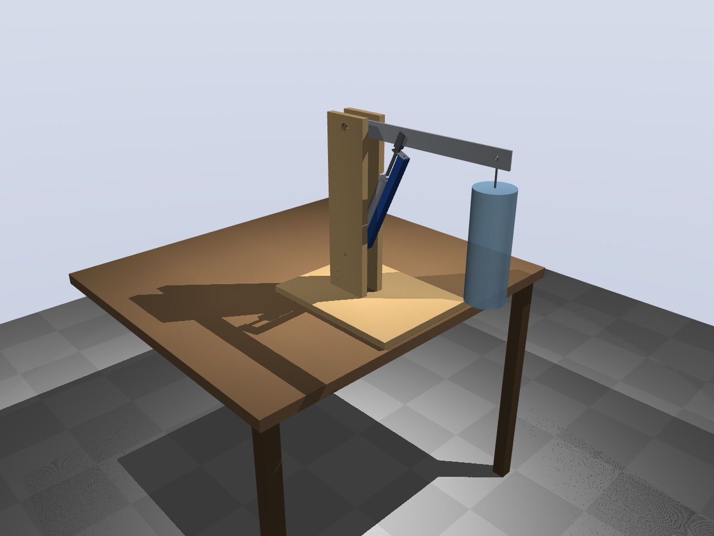

# Test 1 — pneumatische arm met één vrijheidsgraad



## Projectomschrijving

Dit is de eerste en kleinste test van het [pneumatic-arm](../doel.md)-project: een
toegankelijke robotarm die met cilinders werkt, zoals spieren, en met terugkoppeling
wordt aangestuurd door een programma of AI.

Test 1 beantwoordt één vraag: **kan een gewone pneumatische cilinder met goedkope
aan/uit-ventielen een arm naar een gekozen hoek sturen en daar laten staan, snel en op
de millimeter, ook met een last eraan?**

**De opstelling:**
- een arm van 45 cm op een scharnier, bewogen door één cilinder Ø20 × 150 mm;
- per cilinderkamer een vulventiel en een leegventiel (SMC VQ110U, 4 stuks), aangestuurd
  met PWM;
- een lineaire potmeter voor de positie, een druksensor per kamer, en een Raspberry
  Pi Pico 2 die 500 keer per seconde regelt.

**Wat het oplevert:**
- het antwoord of pneumatiek werkt voor deze arm;
- het getal dat bepaalt hoe groot de cilinders van schouder en elleboog moeten worden
  (proef T7);
- de regelsoftware die straks meegaat naar de echte arm.

**Doelen in getallen** (proef T3): doorschot < 5 mm, binnen 1 s stil, restfout < 1 mm.
De simulatie haalt dat met de huidige afstelling; zie [resultaten](out/sim/resultaten.md).

## Wat er in dit pakket zit

| Map / bestand | Inhoud |
|---|---|
| [`docs/handleiding.md`](docs/handleiding.md) | **Begin hier.** Ontvangstcontrole, bouwen, aansluiten, software, kalibreren, proeven T0–T7, problemen oplossen |
| [`docs/ontwerp.md`](docs/ontwerp.md) | Waarom zo: ventielkeuze, pneumatiek, elektronica, mechanica, regeling, simulatie |
| [`docs/stuklijst.md`](docs/stuklijst.md) | Stuklijst (BOM) met artikelen, varianten, aantallen en prijzen; ook als CSV |
| `out/tekeningen/` | Zijaanzicht, maattekening wang en arm, elektrisch schema, aansluitlijst, pneumatisch schema (PNG + PDF) |
| `out/cad/` | CAD: STEP per onderdeel en van de samenstelling, STL, DXF-profielen, GLB (3D in de browser) |
| `out/sim/` | Simulatieresultaten, grafieken en renders |
| `params.py` | **Alle maten en instellingen.** Al het andere wordt hieruit gegenereerd |
| `cad/` | CadQuery-model (`parts.py`) en export (`export.py`) |
| `sim/` | MuJoCo-model (`model.py`), pneumatiekmodel (`pneumatics.py`), scenario's (`run.py`) |
| `firmware/` | MicroPython voor de Pico 2: `main.py`, `control.py` (regeling), `hw.py`, `config.py` (gegenereerd) |
| `host/` | Pc-programma's: `logger.py` (handbediening + opname), `proeven.py` (T0–T7 automatisch), `analyse.py` |
| `tests/test_firmware.py` | Draait de firmware op de pc met nagebootste hardware |
| `build.py` | Genereert alles opnieuw en maakt de bundel |

## Snel aan de slag

- **Bouwen:** volg [de handleiding](docs/handleiding.md) van boven naar beneden.
- **Simulatie draaien:**
  ```
  pip install -r requirements.txt
  python sim/run.py --render
  ```
- **Iets veranderen** (een maat, een versterking): pas `params.py` aan en draai
  `python build.py`. CAD, simulatie, firmware-instellingen, tekeningen en stuklijst
  lopen dan weer gelijk.

## Status

| Onderdeel | Stand |
|---|---|
| Ontwerp, CAD, tekeningen | klaar |
| Simulatie en afstelling | klaar; T3 geslaagd in simulatie |
| Firmware en pc-programma's | klaar, getest met nagebootste hardware; nog niet op de echte Pico |
| Onderdelen | AliExpress besteld 2026-10-04; elektronica, compressor en bouwmarkt nog te kopen |
| Bouwen en proeven T0–T7 | nog te doen |

## Licentie en delen

Ontworpen om na te bouwen met gewone onderdelen. Alle bronbestanden (CadQuery, MuJoCo,
MicroPython, Python) zijn tekst en open; er is geen betaalde software nodig.
