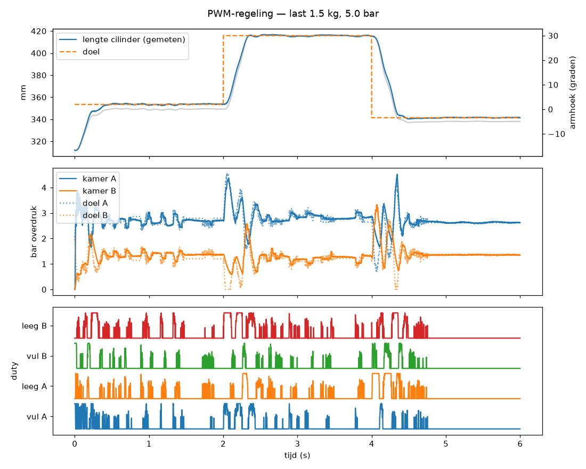
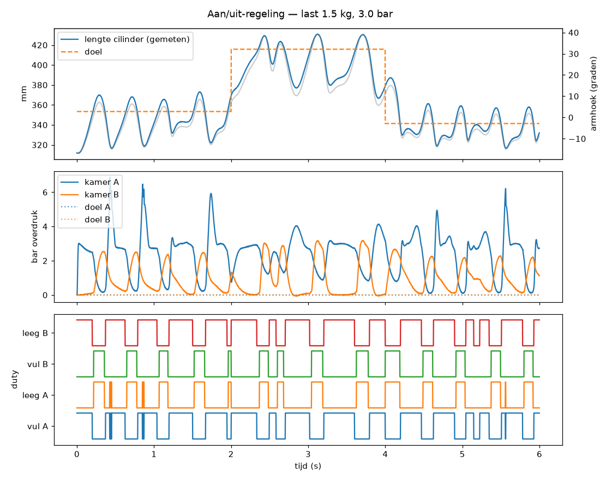

# Simulatie test 1 — resultaten

Last 1.5 kg, voeding 5.0 bar, afstelling uit `params.py`. Criteria T3: doorschot < 5 mm, ingesteld (binnen ±1 mm) binnen 1 s, restfout < 1 mm.

## T3 PWM-regeling en T2 aan/uit-regeling

| Sprong | Doorschot (mm) | Insteltijd (s) | Restfout (mm) | Geslaagd |
|---|---|---|---|---|
| PWM: 0° → 30° | 1.04 | 0.92 | 0.27 | ja |
| PWM: 30° → −5° | 1.17 | 0.508 | 0.11 | ja |
| aan/uit (3 bar): 0° → 30° | 15.09 | 1.998 | 21.6 | nee |
| aan/uit (3 bar): 30° → −5° | 24.77 | 1.998 | 13.32 | nee |

## T7 belastingsgraad

| Last (kg) | Belasting (%) | Doorschot (mm) | Insteltijd (s) | Restfout (mm) | Geslaagd |
|---|---|---|---|---|---|
| 0.5 | 14 | 1.74 | 1.936 | 0.46 | nee |
| 1.5 | 35 | 1.04 | 0.92 | 0.27 | ja |
| 2.5 | 57 | 3.04 | 1.982 | 0.45 | nee |
| 3.5 | 78 | 2.24 | 1.998 | 1.2 | nee |
| 4.5 | 100 | 0.0 | 1.998 | 53.69 | nee |
| 5.5 | 122 | 0.0 | 1.998 | 105.49 | nee |

## T6 stijfheid (ventielen dicht, 15 N extra aan de last)

| Som kamerdrukken (bar) | Uitwijking (graden) |
|---|---|
| 2.0 | 14.13 |
| 5.0 | 10.44 |
