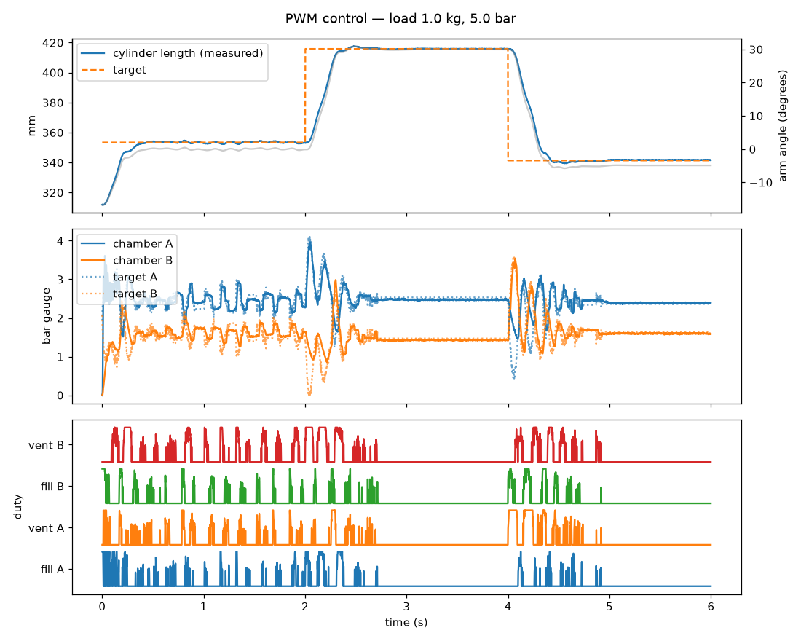
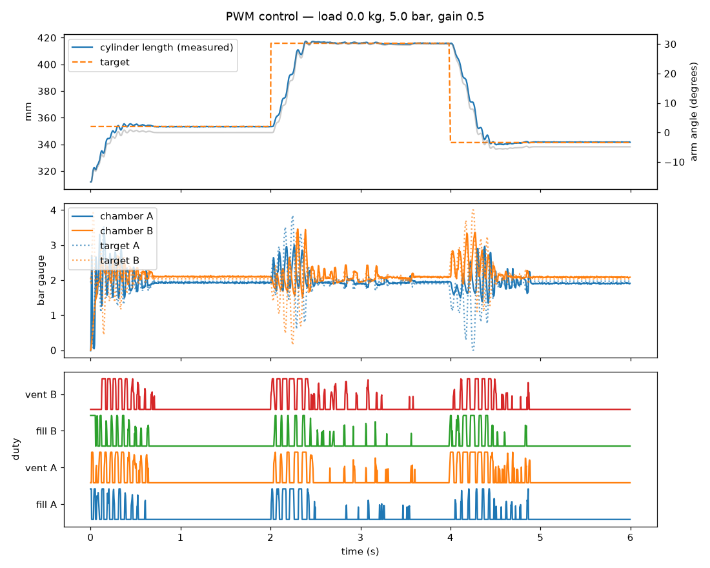
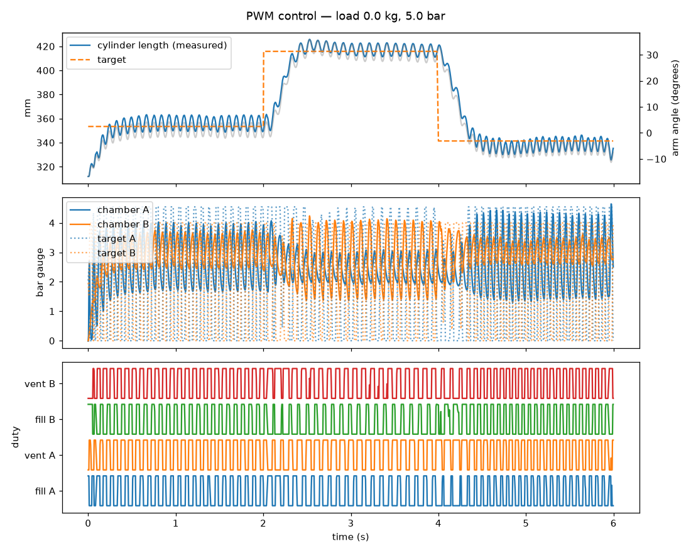
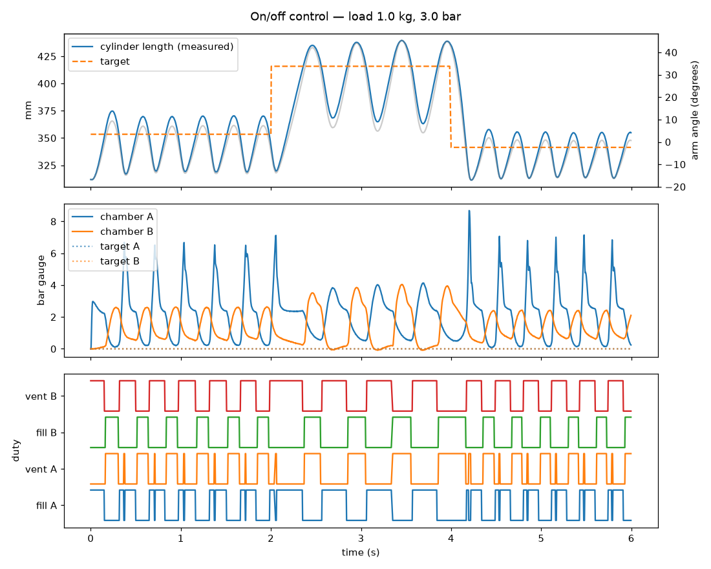
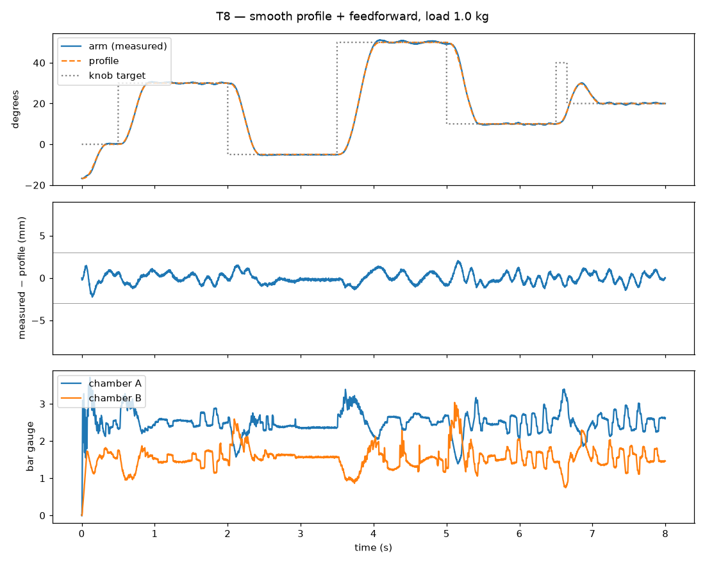
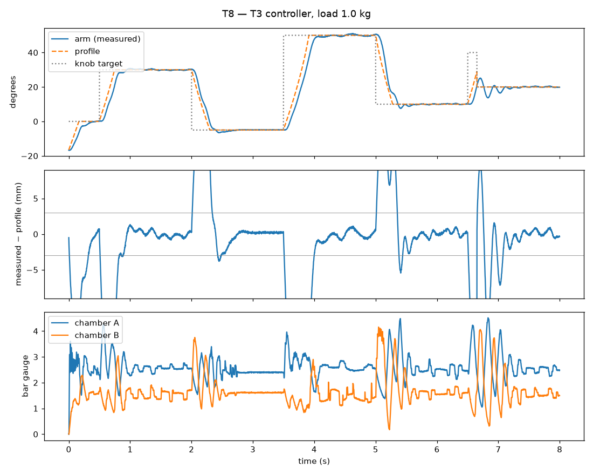

# Simulation of test 1 — results

Load 1.0 kg, supply 5.0 bar, tuning from `params.py`. T3 criteria: overshoot < 5 mm, settled (within ±1 mm) within 1 s, error < 1 mm.

## T3 PWM control and T2 on/off control

| Step | Overshoot (mm) | Settling (s) | Error (mm) | Passed |
|---|---|---|---|---|
| PWM, no load, gain 0.5: 0° → 30° | 1.49 | 0.544 | 0.15 | yes |
| PWM, no load, gain 0.5: 30° → −5° | 1.67 | 0.636 | 0.33 | yes |
| PWM, no load, gain 1: 0° → 30° | 9.99 | 1.98 | 3.61 | no |
| PWM, no load, gain 1: 30° → −5° | 15.77 | 1.996 | 4.86 | no |
| PWM, 1 kg: 0° → 30° | 1.54 | 1.48 | 0.33 | no |
| PWM, 1 kg: 30° → −5° | 2.57 | 0.66 | 0.23 | yes |
| on/off (3 bar): 0° → 30° | 23.74 | 1.984 | 24.47 | no |
| on/off (3 bar): 30° → −5° | 30.02 | 1.996 | 13.4 | no |

## T7 load ratio

| Load (kg) | Load (%) | Overshoot (mm) | Settling (s) | Error (mm) | Passed |
|---|---|---|---|---|---|
| 1.0 | 24 | 1.54 | 1.48 | 0.33 | no |
| 2.0 | 46 | 2.09 | 0.556 | 0.43 | yes |
| 3.0 | 68 | 3.54 | 1.42 | 0.44 | no |
| 4.0 | 89 | 0.0 | 1.984 | 10.74 | no |
| 5.0 | 111 | 0.0 | 1.984 | 86.57 | no |

## T6 stiffness (valves closed, one 1 kg plate added)

| Sum of chamber pressures (bar) | Deflection (degrees) |
|---|---|
| 2.0 | 9.81 |
| 5.0 | 6.74 |

## T8 preset positions: smooth profile with feedforward

Load 1 kg (dumbbell plates bolted to the arm end), 5.0 bar. Targets 30°, -5°, 50°, 10°, 40°, 20° (the last two 0.15 s apart: a new target during a move). Criteria per move: tracking error < 3 mm, overshoot < 2 mm, within ±1.5 mm at most 0.2 s after the profile ends, mean error at rest < 1 mm. Worst case of 3 runs with different sensor noise.

| Move | Profile (s) | Tracking (mm) | Overshoot (mm) | Settled after the profile (s) | Command → settled (s) | Passed |
|---|---|---|---|---|---|---|
| → 30° | 0.404 | 1.12 | 1.14 | 0.0 | 0.404 | yes |
| → -5° | 0.432 | 0.99 | 1.37 | 0.0 | 0.432 | yes |
| → 50° | 0.584 | 1.29 | 1.13 | 0.0 | 0.584 | yes |
| → 10° | 0.452 | 1.37 | 0.91 | 0.0 | 0.452 | yes |
| → 20° | 0.672 | 1.03 | 23.79 | 0.0 | 0.672 | yes |

(one run; the last row is the new target during a move: its overshoot is past the new, nearer target and does not count)

| Controller / setting | Tracking (mm) | Overshoot (mm) | Settled after the profile (s) | New target during a move: tracking (mm) | Passed |
|---|---|---|---|---|---|
| profile 170°/s, 1550°/s² (params.py) | 2.51 | 1.58 | 0.32 | 1.26 | no |
| 1.1× as fast (187°/s, 1876°/s²) | 3.0 | 2.41 | 0.048 | 1.58 | no |
| 1.15× as fast (195°/s, 2050°/s²) | 4.19 | 4.06 | 0.184 | 1.78 | no |
| 1.3× as fast (221°/s, 2620°/s²) | 4.34 | 5.06 | 0.212 | 4.75 | no |
| 2 kg load, same profile | 4.04 | 2.09 | 0.664 | 3.27 | no |
| 2 kg load, 10% lower speed | 3.31 | 1.43 | 0.0 | 2.12 | no |
| 2 kg load, 20% lower speed | 1.69 | 1.19 | 0.0 | 1.31 | yes |
| load set to 0.9 kg (real 1.0 kg) | 2.28 | 2.37 | 0.68 | 1.75 | no |
| load set to 1.1 kg (real 1.0 kg) | 2.03 | 1.56 | 0.936 | 1.44 | no |
| load set to 0.8 kg (real 1.0 kg) | 2.71 | 1.72 | 0.684 | 1.65 | no |
| load set to 1.2 kg (real 1.0 kg) | 1.69 | 1.51 | 0.32 | 1.27 | no |
| T3 controller (ramp 250 mm/s, no feedforward) | 19.6 | 6.21 | 0.324 | 19.65 | no |

