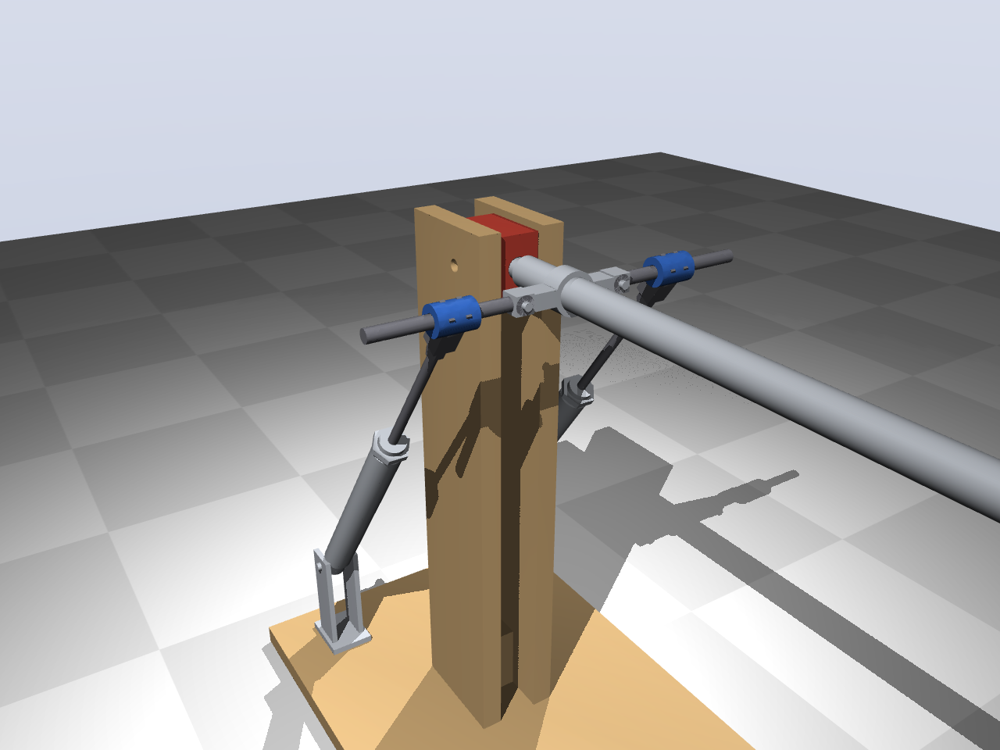
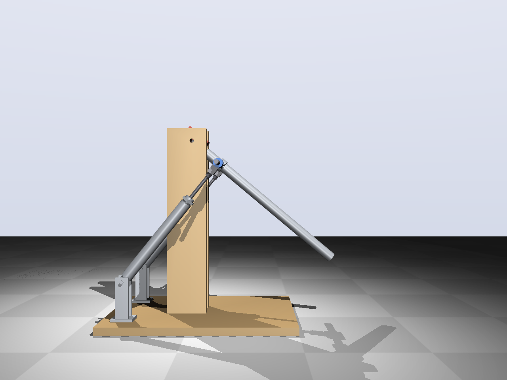
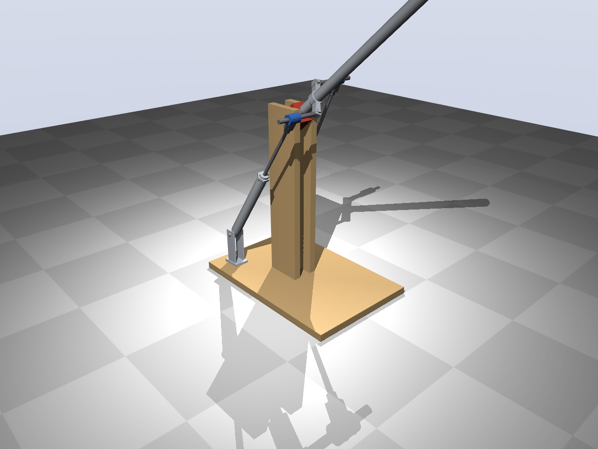
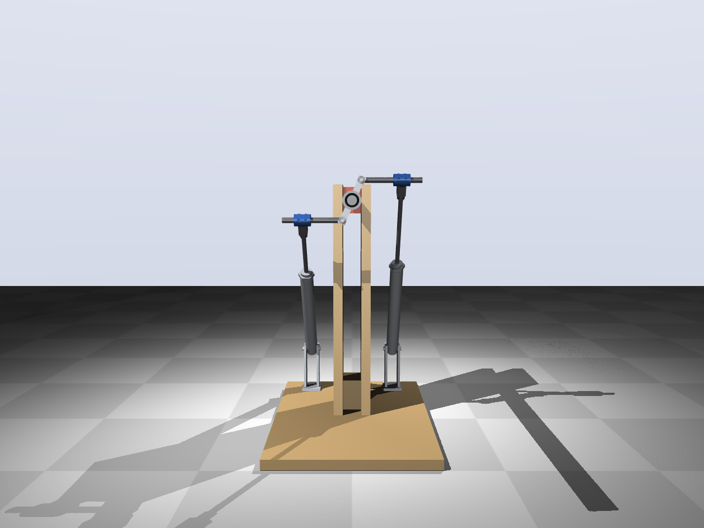

# Test 2 — 2-DOF joint (concept)

Concept of the joint from [docs/2dof-joint.md](../docs/2dof-joint.md), built on test 1:
the hinge becomes a universal joint (pitch + roll) and a second cylinder is added. Same
Ø20 × 150 cylinders, same upright.

**Mechanism (concept B, from the customer's sketch):**
- A hub on the arm axis, 90 mm from the joint, carries two hinges (axis parallel to the
  arm, ±90°), 40 mm left and right of the axis.
- From each hinge a horizontal bar (Ø10) runs outward through a sleeve on the rod end of
  a cylinder. The sleeve lets the bar turn about its own axis and slide sideways.
- The cylinders lean back by 30–40° to clevis brackets behind the upright (x = −150,
  z = 90, 90 mm to the sides). The base plate is extended to x = −200 for them.
- Both cylinders out: pitch up. One out, one in: roll about the arm's own axis.

**Range (stroke, bar length and a collision check with `python cad/model.py --clash`):**

| Pitch | Roll reachable | Pitch lever | Pitch torque, 2 × Ø20 at 5 bar |
|---|---|---|---|
| −40° | ±65° | 90 mm | 28 Nm |
| 0° | ±90° | 73 mm | 23 Nm |
| +30° | ±75° | 43 mm | 14 Nm |
| +50° | ±60° | 19 mm | 6 Nm |

Design range: pitch −40° … +50° (90°) with roll ±60–65° everywhere. The roll torque
scales with cos(roll), so roll beyond ±65° is not useful anyway. The lever shrinks
towards the top: at +50° a 1.5 kg load at 400 mm needs about 70% of the available
torque. Around +65° the cylinders line up with the hub (dead point), so the arm needs a
**mechanical end stop at about +52°**; otherwise it can be pushed over the top.

Files: `t2params.py` (dimensions), `cad/model.py` (CadQuery), `render.py` (renders and
`out/test2_concept.step`).

Status: concept for discussion, not yet worked out or simulated.
