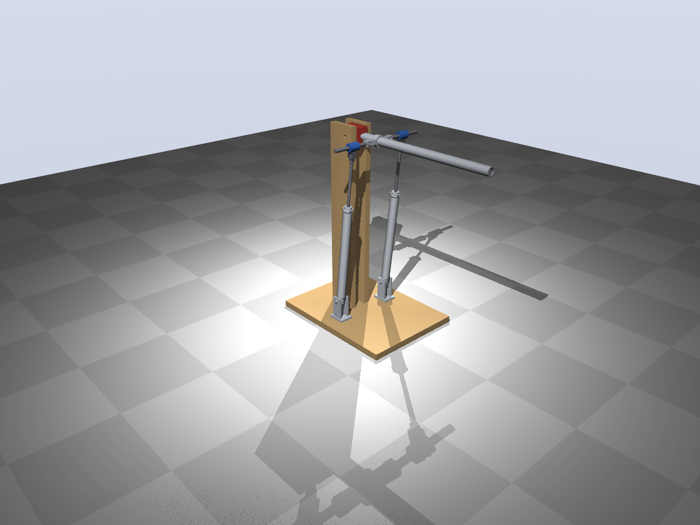
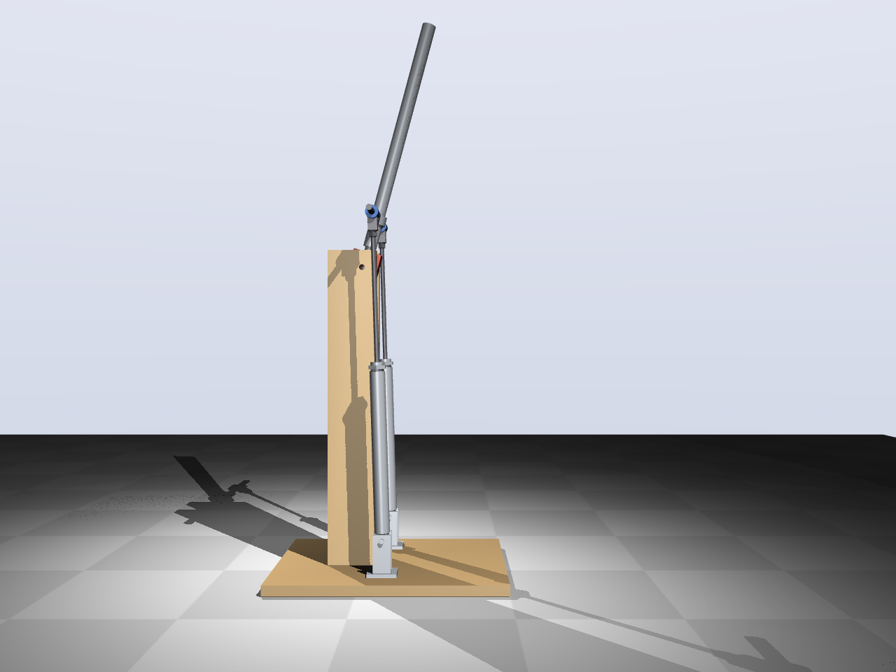

# Test 2 — 2-DOF joint (concept)

Concept of the joint from [docs/2dof-joint.md](../docs/2dof-joint.md), built on test 1:
the hinge becomes a universal joint (pitch + roll) and two cylinders drive it. Ø20 like
test 1, but with 200 mm stroke (MAL20×200), and the upright is 100 mm taller.

**Mechanism (concept B, from the customer's sketch):**
- A hub on the arm axis, 90 mm from the joint, carries two hinges (axis parallel to the
  arm, ±90°), 40 mm left and right of the axis.
- From each hinge a horizontal bar (Ø10) runs outward through a sleeve on the rod end of
  a cylinder. The sleeve lets the bar turn about its own axis and slide sideways.
- The joint sits 520 mm above the base plate (test 1: 420). The cylinders stand almost
  upright (within 6°) under the hub, 90 mm to the sides, on low clevis brackets
  (pivot 40 mm in front of the joint, 60 mm above the plate).
- The cheeks end 25 mm in front of the joint, so the hub clears them with the arm down.
- Both cylinders out: pitch up. One out, one in: roll about the arm's own axis.

**Range (stroke, bar length and a collision check with `python cad/model.py --clash`):**

| Pitch | Roll reachable | Pitch lever | Pitch torque, 2 × Ø20 at 5 bar |
|---|---|---|---|
| −60° | ±90° (no collision only at roll 0) | 46 mm | 15 Nm |
| −45° | ±90° | 67 mm | 21 Nm |
| 0° | ±90° | 89 mm | 28 Nm |
| +45° | ±90° | 61 mm | 19 Nm |
| +75° | ±65° | 26 mm | 8 Nm |

Design range: pitch −45° … +75° (120°) with roll ±65°, down to −60° without roll. A
1.5 kg load at 400 mm needs at most 6.5 Nm, so the reserve is at least 3.9× over the
whole range. The roll torque scales with cos(roll); about ±65° is the useful roll range.
Near 90° the cylinders point through the joint: the arm needs a **mechanical end stop at
about 80°**.

Why upright cylinders: the angular range of a cylinder on a lever is set by stroke and
lever length, and an inclined cylinder wastes part of the stroke. With the cylinders
leaning at least 35°, the same 200 mm stroke reaches only −45° … +45° with less torque.

Files: `t2params.py` (dimensions), `cad/model.py` (CadQuery), `render.py` (renders and
`out/test2_concept.step`).

Status: concept for discussion, not yet worked out or simulated.
