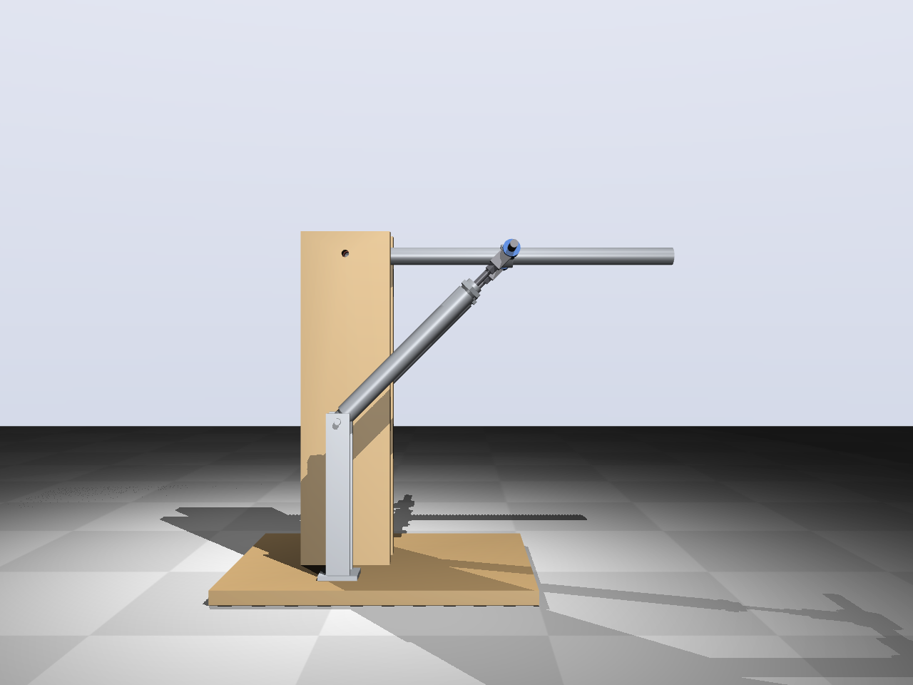

# Test 2 — 2-DOF joint (concept)

Concept of the joint from [docs/2dof-joint.md](../docs/2dof-joint.md), built on test 1:
the hinge becomes a universal joint (pitch + roll) and a second cylinder is added. Same
Ø20 × 150 cylinders, same upright.

**Mechanism (concept B, from the customer's sketch):**
- A hub on the arm axis carries two hinges (axis parallel to the arm, ±90°), 40 mm left
  and right of the axis.
- From each hinge a horizontal bar (Ø10) runs outward through a sleeve on the rod end of
  a cylinder. The sleeve lets the bar turn about its own axis and slide sideways.
- Right-angle layout: the hub sits x = 220 mm in front of the joint, the lower cylinder
  pivots x = 220 mm straight below it (on posts 90 mm to the sides), and x·√2 = 311 mm is
  the retracted cylinder length. Arm horizontal: cylinders retracted, leaning 45°. Arm
  vertical: cylinders at 440 mm, straight up. So the stroke covers a 90° pitch range.
- Both cylinders out: pitch up. One out, one in: roll about the arm's own axis.

**Range (stroke, bar length and a collision check with `python cad/model.py --clash`):**

| Pitch | Roll reachable | Pitch lever | Pitch torque, 2 × Ø20 at 5 bar |
|---|---|---|---|
| 0° | — (both cylinders retracted) | 155 mm | 49 Nm |
| 10° | ±80° | 141 mm | 44 Nm |
| 45° | ±90° | 84 mm | 26 Nm |
| 80° | ±90° | 19 mm | 6 Nm |
| 90° | ±90° | 0 mm | 0 Nm (dead point) |

Design range: pitch 0° … 85°. A 1.5 kg load at 400 mm needs 6.5 Nm at horizontal, so
there is a large reserve. Roll needs one cylinder to retract further, so it is only
available from about 8° up. The roll torque scales with cos(roll); about ±65° is the
useful roll range. At 90° the cylinders point through the joint: the arm needs a
**mechanical end stop at about 85°**.

Files: `t2params.py` (dimensions), `cad/model.py` (CadQuery), `render.py` (renders and
`out/test2_concept.step`).

Status: concept for discussion, not yet worked out or simulated.
